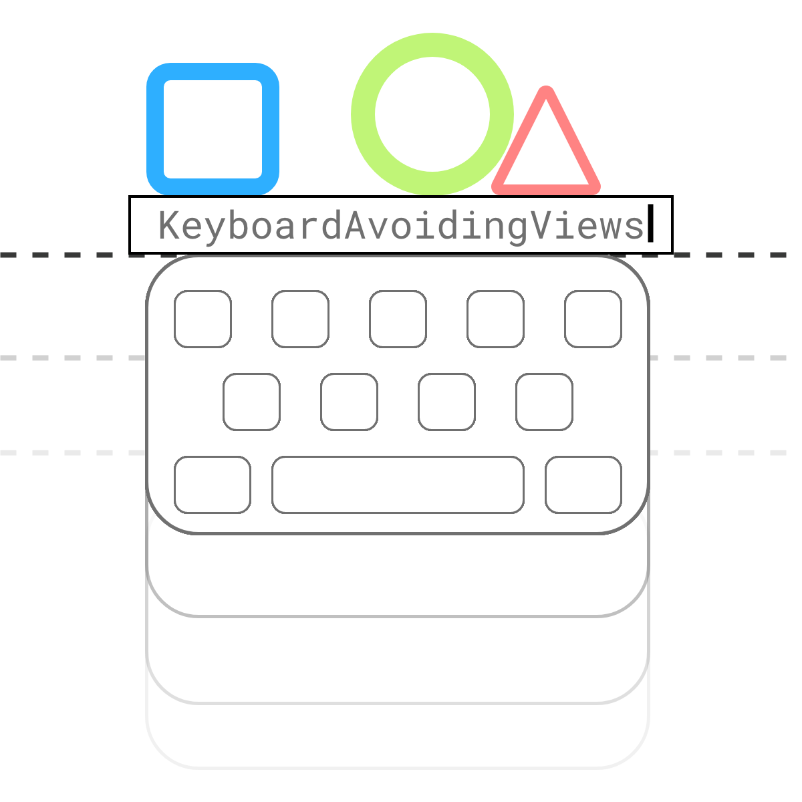

# keyboard-avoiding-views



Add maven jitpack repository:
```
    maven { url 'https://jitpack.io' }
```
and a library reference in dependencies {} block

```
    implementation "com.github.obiwanzenobi:keyboard-avoiding-views:0.0.1"
```

Use as following:

```
 <com.wojciechwarwas.keyboard_avoiding_views.KeyboardAvoidingLayout
        android:layout_width="match_parent"
        android:layout_height="wrap_content"
        app:layout_constraintBottom_toBottomOf="parent">

    <TextView
            android:layout_width="wrap_content"
            android:layout_height="wrap_content"
            android:text="Hello World!" />

</com.wojciechwarwas.keyboard_avoiding_views.KeyboardAvoidingLayout>

<com.wojciechwarwas.keyboard_avoiding_views.KeyboardAvoidingGuideline
        android:id="@+id/keyboardAvoidingGuideline"
        android:layout_width="wrap_content"
        android:layout_height="wrap_content"
        android:orientation="horizontal"
        app:layout_constraintGuide_end="0dp"
        tools:ignore="MissingConstraints" />

<TextView
        android:layout_width="wrap_content"
        android:layout_height="wrap_content"
        android:text="Guideline constrained"
        app:layout_constraintBottom_toBottomOf="@id/keyboardAvoidingGuideline"
        app:layout_constraintEnd_toEndOf="parent" />
```

